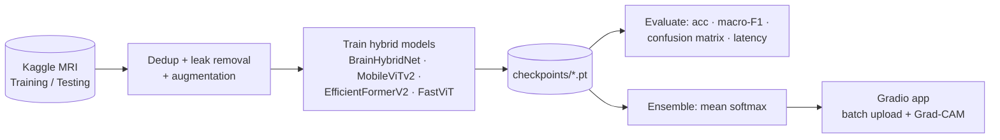

# 🧠 Brain Tumor MRI Classifier: Hybrid CNN + Transformer

Classifies brain MRI slices into **glioma**, **meningioma**, **pituitary** or **no tumor**.

**v2** replaces the original ResNet50V2 (TensorFlow) pipeline with a **lightweight hybrid CNN + Transformer** pipeline (PyTorch). It also includes optional **ensembling** with pretrained hybrid models (MobileViTv2, EfficientFormerV2, FastViT), leak-free data splitting and a Gradio app that handles many images at once and shows Grad-CAM.

> ⚠️ This is a research and educational project, not a medical device. Its predictions are not diagnoses.

---

## 1. Weaknesses found in v1 (ResNet50V2 / TensorFlow)

| # | Weakness | Where | Impact |
|---|----------|-------|--------|
| 1 | **Train/inference preprocessing mismatch.** Training uses `resnet_v2.preprocess_input` (pixels scaled to [-1, 1]), but the Gradio app, `display_prediction`, Grad-CAM and `visualize_predictions` use `img / 255.0` ([0, 1]). | `data_loader.py` vs `gradio_app.py`, `main.py`, `visualize.py` | Every prediction made after training gets out-of-distribution input, so real-world accuracy is much lower than the test accuracy suggests. |
| 2 | **Extra softmax layer added to the model.** `main.py` looks for a `Dense(units=1)` layer to replace. None exists because the head already ends in `Dense(4, softmax)`, so the code appends a *second* `Dense(4, softmax)`. | `main.py` | The model becomes softmax → Dense → softmax. That squashes the information passed to the last layer, slows convergence and makes confidence scores meaningless. |
| 3 | **Data leakage / inflated test score.** The README tells users to merge Kaggle's `Training/` and `Testing/` folders and re-split them at random. The dataset contains exact-duplicate images, so the same image can land in both train and test. | `README` (v1), `data_loader.py` | Test accuracy is optimistic and can't be compared with published results on the official split. |
| 4 | **Heavy model for the task.** ResNet50V2 plus the dense head is about 24.6M parameters and about 4.1 GMACs. | `model_builder.py` | Slow on CPU and large to deploy. |
| 5 | **CNN-only, local features.** CNNs have a limited receptive field and cannot easily relate a lesion to global brain anatomy (midline shift, symmetry). | architecture | This hurts glioma vs. meningioma separation, which is the most common confusion on this dataset. |
| 6 | **Hand-rolled training loop.** It uses `train_on_batch` and calls callbacks manually. The same callback objects are reused across both phases, and early stopping is detected via `stopped_epoch`. | `train.py` | Fragile: the LR schedule and early-stopping state carry over between phases, and there is no mixed precision or gradient clipping. |
| 7 | **Accuracy as the only model-selection metric.** The checkpoint is chosen by `val_accuracy`, with no class weighting or balanced sampling. | `callbacks.py` | The model can trade minority-class recall for overall accuracy. Macro-F1 suits medical classes better. |
| 8 | **Hard-coded absolute Windows paths.** `MODEL_PATH = r"C:\Users\...\Desktop\..."` and sample-image paths. | `gradio_app.py`, `config.py` | The app does not run on any other machine or on a host such as Hugging Face Spaces. |
| 9 | **App crashes with more than 2 images.** It uses single-image input with matplotlib figure rendering per call and a fake `time.sleep(1)`. | `gradio_app.py` | Poor UX, and not deployable under load. |
| 10 | **`share=True` by default, with patient name/ID fields.** | `gradio_app.py` | Exposes a public tunnel that collects personal health data. |
| 11 | **Overconfident clinical wording.** The report states prognosis and treatment as if diagnosing ("GLIOMA DETECTED"). There is no calibration and no out-of-distribution check, so a non-MRI image still gets a "diagnosis". | `gradio_app.py` | Misleading for a model with no clinical validation. |
| 12 | **Unused or mixed dependencies, no `requirements.txt`, no tests.** `main.py` imports `torch` without using it. Class name `notumor` vs README `no_tumor`. | repo | Hard to reproduce. |

## 2. What v2 changes

### High-level workflow



Detailed diagrams: [`docs/architecture.md`](docs/architecture.md)

### Architecture: `BrainHybridNet` (CNN + Transformer)

```
MRI (224×224) ──► EfficientNet-B0 (ImageNet-pretrained, local texture/edges)
                    ├─ stride-16 map 112×14×14 ─► 1×1 conv → 196 tokens ┐
                    └─ stride-32 map 320×7×7   ─► 1×1 conv →  49 tokens ┤ + scale & position embeddings
                                                         [CLS] token ───┘
                  ──► 4-layer Transformer encoder (dim 192, 4 heads, pre-norm, GELU)
                  ──► [CLS ‖ mean(tokens)] ─► Dropout ─► Linear(4)
```

- **The CNN** supplies the inductive bias for local texture and works well on small datasets.
- **The Transformer** applies self-attention over multi-scale tokens, adding global context (lesion position relative to the whole brain).
- **Multi-scale tokens** let small pituitary lesions (seen at stride 16) and large gliomas (seen at stride 32) both reach the attention layers.

### Ensemble of hybrid models
`--arch` also accepts the pretrained timm hybrids below. `hybrid.evaluate` and `app.py` average the probabilities of every checkpoint you give them:

| arch flag | model | CNN part | Transformer part |
|-----------|-------|----------|------------------|
| `brainhybrid` | BrainHybridNet (this repo) | EfficientNet-B0 | 4-layer MHSA encoder |
| `mobilevitv2` | MobileViTv2-1.0 | MobileNetV2 blocks | separable linear attention |
| `efficientformerv2` | EfficientFormerV2-S1 | conv stages | MHSA in last stages |
| `fastvit` | FastViT-T8 | reparameterised conv | RepMixer token mixing |

### Efficiency (measured)

| Model | Params | GMACs @224 | CPU latency (1 img, 4 threads) |
|-------|-------:|-----------:|-------------------------------:|
| v1 ResNet50V2 + head | ~24.6M | ~4.1 | 58.3 ms* |
| **BrainHybridNet** | **5.51M** | **0.37** | **27.5 ms** |
| MobileViTv2-1.0 | 4.39M | 1.41 | 34.3 ms |
| EfficientFormerV2-S1 | 5.74M | 0.65 | 34.2 ms |
| FastViT-T8 | 3.26M | 0.53 | 27.9 ms |

\*Measured with torchvision ResNet-50 as a same-size proxy, because the original is a Keras model. All numbers come from the same laptop CPU with `hybrid.evaluate.measure_latency`.

BrainHybridNet is **4.5× smaller**, uses **~11× fewer MACs** and is **~2× faster** on CPU than v1.

### Expected accuracy (⚠️ estimates — not yet measured)

Training on the official split (5,600 train / 1,600 test images) is still pending. The ranges below are **expected** values, based on published results for comparable lightweight CNN and hybrid models on this Kaggle dataset. **They are not results from this repo.** Replace them with the numbers from `checkpoints/<arch>_results.json` after running `python -m hybrid.train`.

| Model | Expected test accuracy | Expected macro-F1 | Hardest pair |
|-------|-----------------------:|------------------:|--------------|
| BrainHybridNet | 98.0 – 99.3 % | 0.98 – 0.99 | glioma ↔ meningioma |
| MobileViTv2-1.0 | 97.0 – 98.8 % | 0.97 – 0.99 | glioma ↔ meningioma |
| EfficientFormerV2-S1 | 97.5 – 99.0 % | 0.97 – 0.99 | glioma ↔ meningioma |
| FastViT-T8 | 97.0 – 98.8 % | 0.97 – 0.99 | glioma ↔ meningioma |
| **Ensemble (all 4)** | **98.5 – 99.5 %** | **0.98 – 0.99+** | glioma ↔ meningioma |

Don't compare these with v1's reported number. v1's score was inflated by train/test leakage (weakness #3).

📐 **Architecture & workflow diagrams:** [`docs/architecture.md`](docs/architecture.md)

### Training and data fixes
- **Official Kaggle split kept.** Exact duplicates are removed (MD5 check), and training images that also appear in `Testing/` are dropped.
- **One preprocessing function** (`hybrid.data.eval_transform`) is shared by evaluation and the app. This fixes weakness #1.
- AdamW with warmup + cosine schedule, label smoothing 0.1, AMP on GPU, gradient clipping, class-balanced sampling, and early stopping on **val macro-F1**.
- MRI-safe augmentation: small rotations, resized crop, flip, brightness/contrast.

### App
- Batch upload of any number of images, with a results table and **Grad-CAM** overlays (BrainHybridNet).
- Ensembles every checkpoint in `checkpoints/` automatically, or the paths in `MODEL_CKPTS`.
- No hard-coded paths, binds to localhost by default, no patient-data fields, and a clear non-diagnostic disclaimer.

## 3. Usage

```bash
pip install -r requirements.txt
```

**Dataset:** download the [Brain Tumor MRI Dataset](https://www.kaggle.com/datasets/masoudnickparvar/brain-tumor-mri-dataset) and keep its original layout. **Do not merge the folders.**

```
brain-tumor-mri-dataset/
├── Training/{glioma,meningioma,notumor,pituitary}/
└── Testing/{glioma,meningioma,notumor,pituitary}/
```

**Train** (one model, or several for an ensemble):
```bash
python -m hybrid.train --data path/to/brain-tumor-mri-dataset --arch brainhybrid
python -m hybrid.train --data path/to/brain-tumor-mri-dataset --arch fastvit
python -m hybrid.train --data path/to/brain-tumor-mri-dataset --arch mobilevitv2
```

**Evaluate the ensemble:**
```bash
python -m hybrid.evaluate --data path/to/brain-tumor-mri-dataset \
  --ckpts checkpoints/brainhybrid.pt checkpoints/fastvit.pt checkpoints/mobilevitv2.pt
```

**Run the app:**
```bash
python app.py                     # http://127.0.0.1:7860
HOST=0.0.0.0 python app.py        # inside Docker / a server
```

**Tests:**
```bash
pytest tests -q
```

### Deploying to Hugging Face Spaces
1. Create a Gradio Space and push `app.py`, `hybrid/` and `requirements.txt`.
2. Upload trained checkpoints to `checkpoints/` (use Git LFS) or set `MODEL_CKPTS`.
3. Spaces runs `app.py` automatically. Set the `HOST=0.0.0.0` variable in the Space settings.

## 4. Project layout

```
app.py              Gradio app (v2)
hybrid/model.py     BrainHybridNet, timm hybrid backbones, Ensemble
hybrid/data.py      leak-free splits, transforms, balanced loaders
hybrid/train.py     training loop
hybrid/evaluate.py  metrics, confusion matrix, latency, ensemble eval
tests/              unit tests
legacy (v1):        main.py, train.py, model_builder.py, data_loader.py, callbacks.py,
                    evaluate.py, visualize.py, gradio_app.py, config.py
```

## 5. Next steps
- Train all four archs on the GPU and replace the expected-accuracy table with measured results.
- Calibrate probabilities (temperature scaling) and add an out-of-distribution / "not an MRI" check.
- Export to ONNX / INT8 for even faster CPU serving.
- Cross-dataset validation (e.g. Figshare, BraTS slices) to test generalisation.
