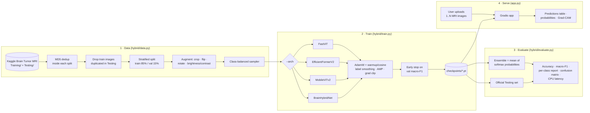
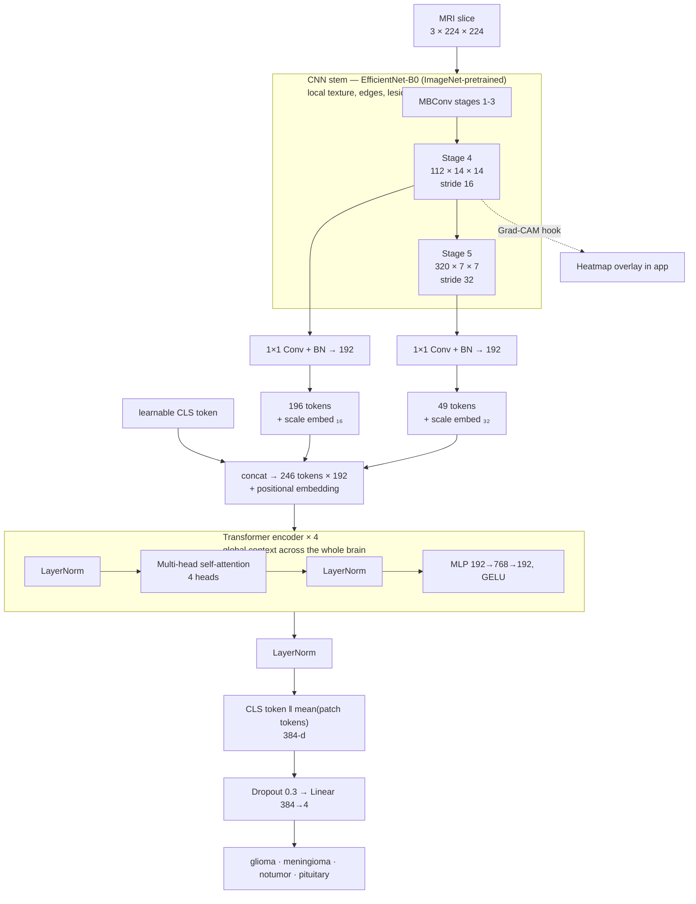

# Architecture & Workflow

## End-to-end workflow

```mermaid
flowchart LR
    subgraph DATA["1 · Data (hybrid/data.py)"]
        K[(Kaggle Brain Tumor MRI<br/>Training/ + Testing/)] --> D[MD5 dedup<br/>inside each split]
        D --> L[Drop train images<br/>duplicated in Testing]
        L --> S[Stratified split<br/>train 85% / val 15%]
        S --> A[Augment: crop · flip ·<br/>rotate · brightness/contrast]
        A --> B[Class-balanced sampler]
    end

    subgraph TRAIN["2 · Train (hybrid/train.py)"]
        B --> M{--arch}
        M --> M1[BrainHybridNet]
        M --> M2[MobileViTv2]
        M --> M3[EfficientFormerV2]
        M --> M4[FastViT]
        M1 & M2 & M3 & M4 --> O[AdamW + warmup/cosine<br/>label smoothing · AMP · grad clip]
        O --> E[Early stop on<br/>val macro-F1]
        E --> C[(checkpoints/*.pt)]
    end

    subgraph EVAL["3 · Evaluate (hybrid/evaluate.py)"]
        C --> T[Official Testing set]
        T --> R[Accuracy · macro-F1 ·<br/>per-class report · confusion matrix ·<br/>CPU latency]
        C --> EN[Ensemble = mean of<br/>softmax probabilities]
        EN --> R
    end

    subgraph SERVE["4 · Serve (app.py)"]
        C --> G[Gradio app]
        U[User uploads<br/>1..N MRI images] --> G
        G --> P[Predictions table ·<br/>probabilities · Grad-CAM]
    end
```

## BrainHybridNet (CNN + Transformer)

```mermaid
flowchart TB
    IN["MRI slice<br/>3 × 224 × 224"] --> CNN

    subgraph CNN["CNN stem — EfficientNet-B0 (ImageNet-pretrained)<br/>local texture, edges, lesion boundaries"]
        S1[MBConv stages 1-3] --> S4[Stage 4<br/>112 × 14 × 14<br/>stride 16]
        S4 --> S5[Stage 5<br/>320 × 7 × 7<br/>stride 32]
    end

    S4 --> P16[1×1 Conv + BN → 192]
    S5 --> P32[1×1 Conv + BN → 192]
    P16 --> T16[196 tokens<br/>+ scale embed ₁₆]
    P32 --> T32[49 tokens<br/>+ scale embed ₃₂]

    CLS[learnable CLS token] --> CAT
    T16 --> CAT
    T32 --> CAT
    CAT["concat → 246 tokens × 192<br/>+ positional embedding"] --> TR

    subgraph TR["Transformer encoder × 4<br/>global context across the whole brain"]
        LN1[LayerNorm] --> MHSA[Multi-head self-attention<br/>4 heads] --> LN2[LayerNorm] --> MLP[MLP 192→768→192, GELU]
    end

    TR --> NORM[LayerNorm]
    NORM --> POOL["CLS token ‖ mean(patch tokens)<br/>384-d"]
    POOL --> HEAD[Dropout 0.3 → Linear 384→4]
    HEAD --> OUT["glioma · meningioma · notumor · pituitary"]

    S4 -. Grad-CAM hook .-> CAM[Heatmap overlay in app]
```
